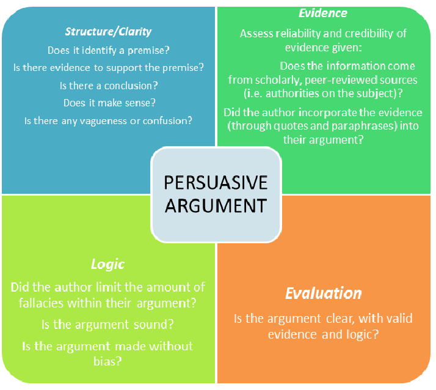

# Elements toward building a good persuasive essay include
- Establishing facts
  - to support an argument
- Clarifying relevant values
  - for your audience (perspective)
- Prioritizing, editing, and/or sequencing
  - the facts and values in importance to build the argument
- Forming and stating conclusions
  - "persuading" your audience that your conclusions
- Are based upon the agreed-upon facts and shared values
  - having the confidence
- To communicate your "persuasion" in writing

## Giving Recommendations and Opinions
### Subject + should/shouldn’t/ need to + do something/ be done

1.	People should not dump the trash into the rivers.
2.	People need to use water wisely.

### When you think something is absolutely necessary:
1.	Water must be purified before it gets home. 
2.	Something has got to be done to stop littering.
